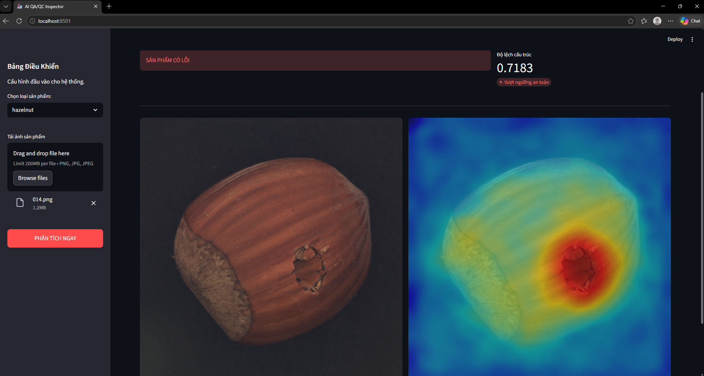

# Hệ thống nhận diện sản phẩm lỗi trong công nghiệp (AI QA/QC Inspector)

Một hệ thống Deep Learning hoàn chỉnh (End-to-End) được thiết kế cho quá trình kiểm định chất lượng tự động trong các nhà máy thông minh. Dự án này ứng dụng mô hình phát hiện bất thường PatchCore để nhận diện, đánh giá và trực quan hóa các lỗi (như trầy xước, nứt vỡ, biến dạng) trên 15 loại sản phẩm công nghiệp khác nhau mà không cần sử dụng dữ liệu lỗi để huấn luyện.

---

## Tính Năng Nổi Bật
- Học Không Giám Sát: Mô hình được huấn luyện hoàn toàn bằng hình ảnh sản phẩm đạt chuẩn, mô phỏng đúng bài toán thực tế trong nhà máy khi dữ liệu về sản phẩm lỗi rất hiếm và khó thu thập.
- Định Vị Lỗi Chính Xác: Tự động tính toán ma trận điểm bất thường và phủ dải màu nhiệt bằng OpenCV để khoanh vùng chính xác vị trí lỗi đến từng pixel.
- Giao Diện Điều Khiển Trực Quan: Xây dựng bằng Streamlit với thanh công cụ điều khiển, cơ chế tải mô hình động và hỗ trợ kiểm tra linh hoạt nhiều loại sản phẩm.
- Tối Ưu Hóa Phần Cứng: Tiết kiệm bộ nhớ thông qua thuật toán Coreset Sampling giúp mô hình huấn luyện mượt mà trên máy tính cá nhân.

---

## Công Nghệ Sử Dụng
- Ngôn ngữ: Python 3.13.12
- Deep Learning Framework: PyTorch
- Mô Hình Cốt Lõi: Anomalib
- Thị Giác Máy Tính: OpenCV, Pillow, NumPy
- Giao Diện Người Dùng: Streamlit
- Xử Lý Dữ Liệu: Pandas

---

## 📁 Cấu Trúc Thư Mục
├── demo.png                       # Ảnh minh họa kết quả nhận diện
├── datasets/
│   └── MVTecAD/                   # Thư mục chứa bộ dữ liệu gốc
│       ├── bottle/
│       ├── cable/
│       └── ...
├── exported_models/     # Chứa các file trọng số (.pt) độc lập cho từng sản phẩm
│   ├── bottle/weights/torch/model.pt
│   ├── cable/weights/torch/model.pt
│   └── ...
├── results/                       # Chứa log huấn luyện và file checkpoint gốc (.ckpt)
├── app.py                         # Mã nguồn giao diện Web Streamlit
├── train.py                       # Script tự động huấn luyện cho 15 sản phẩm
├── export_all.py                  # Script trích xuất và phân tách file trọng số .pt
└── README.md                      # Tài liệu hướng dẫn

---

## Hướng Dẫn Cài Đặt
1. Tải Mã Nguồn
git clone [https://github.com/your-username/industrial-defect-detection.git](https://github.com/your-username/industrial-defect-detection.git)
cd industrial-defect-detection

2. Tạo Và Kích Hoạt Môi Trường Ảo
python -m venv venv
venv\Scripts\activate

3. Cài Đặt Thư Viện
pip3 install torch torchvision --index-url https://download.pytorch.org/whl/cu132
pip install anomalib streamlit opencv-python pillow pandas

---

## Hướng Dẫn Sử Dụng
1. Chuẩn Bị Dữ Liệu
Tải bộ dữ liệu tiêu chuẩn MVTec AD Dataset và giải nén vào thư mục archive.

2. Huấn Luyện & Xuất Mô Hình
Chạy script huấn luyện để mô hình học các đặc trưng bình thường:
python train.py
Sau đó, chạy script xuất file để biên dịch toàn bộ các file checkpoint (.ckpt) sang định dạng tĩnh TorchScript (.pt) cho từng thư mục sản phẩm riêng biệt:
python export.py

3. Khởi Động Giao Diện Web
Kích hoạt bảng điều khiển Streamlit:
streamlit run app.py
Mở trình duyệt tại địa chỉ http://localhost:8501. Hệ thống đã được cấu hình tự động tắt cảnh báo Pickle của PyTorch để nạp trọng số an toàn. Tại thanh menu bên trái, chọn loại sản phẩm bạn muốn kiểm tra và tải ảnh lên.

---

## Đánh Giá & Kết Quả Trực Quan
Kết Quả Nhận Diện Thực Tế
Thuật toán tự động đối chiếu hình ảnh đầu vào với bộ nhớ không gian bình thường, từ đó sinh ra Anomaly Map dưới dạng Tensor. Hệ thống sẽ ép kiểu dữ liệu về NumPy Array và dùng OpenCV để khoanh vùng vết xước.

